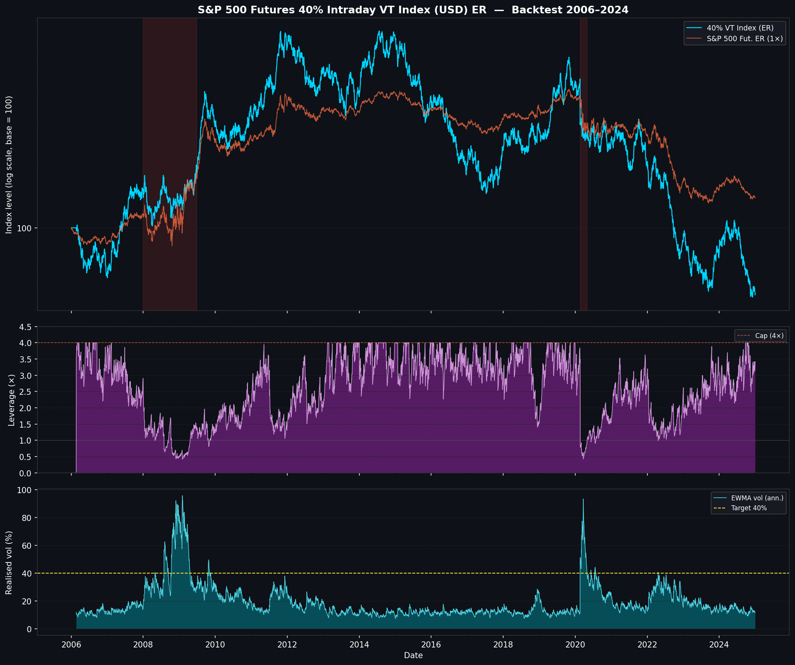

# S&P 500 Futures 40% Intraday VT Index (USD) ER

A Python implementation of the **S&P 500 Futures 40% Intraday Volatility Target Index (USD) Excess Return**, based on the official S&P Dow Jones Indices methodology.

> **Methodology reference:** S&P Dow Jones Indices — *S&P 500 Futures Intraday Volatility Target Indices* (September 2025)
> https://www.spglobal.com/spdji/en/documents/methodologies/methodology-sp-fut-id-vol-tgt-indices.pdf

---

## Table of Contents

1. [Index Overview](#1-index-overview)
2. [Methodology](#2-methodology)
   - 2.1 [Underlying Instrument](#21-underlying-instrument)
   - 2.2 [Intraday VWAP Windows](#22-intraday-vwap-windows)
   - 2.3 [Variance Estimation](#23-variance-estimation)
   - 2.4 [Target Weight (Leverage)](#24-target-weight-leverage)
   - 2.5 [Index Level Calculation](#25-index-level-calculation)
   - 2.6 [Futures Roll](#26-futures-roll)
   - 2.7 [Missing VWAP Handling](#27-missing-vwap-handling)
   - 2.8 [Excess Return vs Total Return](#28-excess-return-vs-total-return)
3. [Key Parameters](#3-key-parameters)
4. [Repository Structure](#4-repository-structure)
5. [Installation](#5-installation)
6. [Usage](#6-usage)
   - 6.1 [Intraday Mode (Full Methodology)](#61-intraday-mode-full-methodology)
   - 6.2 [Daily Mode (Backtest Approximation)](#62-daily-mode-backtest-approximation)
   - 6.3 [Preparing Your Own VWAP Data](#63-preparing-your-own-vwap-data)
7. [Backtest Results (2006–2026)](#7-backtest-results-20062026)
   - 7.1 [Data Pipeline](#71-data-pipeline)
   - 7.2 [Performance Summary](#72-performance-summary)
   - 7.3 [Interpreting the Chart](#73-interpreting-the-chart)
8. [Design Notes and Caveats](#8-design-notes-and-caveats)
9. [References](#9-references)

---

## 1. Index Overview

The **S&P 500 Futures 40% Intraday VT Index (USD) ER** is a rules-based, long-only index that allocates dynamically to E-mini S&P 500 futures with the goal of maintaining a **40% annualised volatility target**.

| Property | Value |
|---|---|
| Underlying | CME E-mini S&P 500 futures (quarterly) |
| Volatility target | **40% annualised** |
| Maximum leverage | **4×** notional |
| Rebalancing frequency | Intraday — end of every VWAP observation window |
| Return type | **Excess Return (ER)** — no cash/risk-free rate component |
| Currency | USD |

The index belongs to the *S&P 500 Futures Intraday Volatility Target* family. All members share the same VWAP-based rebalancing engine; they differ only in their volatility target (e.g. 10%, 20%, 40%) and leverage cap.

---

## 2. Methodology

### 2.1 Underlying Instrument

The index holds **E-mini S&P 500 futures** (CME ticker: ES). At any given time exactly one quarterly contract is held (March, June, September, or December expiry). The number of contracts changes at the end of each VWAP observation window to bring the notional exposure in line with the target weight.

### 2.2 Intraday VWAP Windows

The trading day (9:30 AM – 4:00 PM ET) is divided into **N = 78** non-overlapping **5-minute observation windows**.

Window convention (per S&P DJI): **left-closed, right-open** — trades executed at or after the window start time and strictly before the window end time are included in that window's VWAP.

```
Window 1 : [09:30, 09:35)
Window 2 : [09:35, 09:40)
  …
Window 78: [15:55, 16:00)
```

The **VWAP** for window *h* on day *t* is:

$$\text{VWAP}(t, h) = \frac{\sum_i P_i \cdot V_i}{\sum_i V_i}$$

where the sum runs over all trades within the window.

The **intraday return** for window *h* is the ratio of consecutive VWAPs:

$$r(t, h) = \frac{\text{VWAP}(t, h)}{\text{VWAP}(t, h-1)} - 1$$

The boundary case *h = 1* on day *t* uses the VWAP of the **last window (*h = N*) on day *t − 1*** as the denominator.

### 2.3 Variance Estimation

The index uses an **Exponentially Weighted Moving Average (EWMA)** to estimate per-window variance.

**Initialisation** (first 35 windows after the index inception date):

$$\hat{\sigma}^2_{\text{init}} = \frac{1}{35} \sum_{h=1}^{35} r(h)^2$$

**EWMA update** for every subsequent window:

$$\hat{\sigma}^2(t, h) = \lambda \cdot \hat{\sigma}^2(t, h-1) + (1 - \lambda) \cdot r(t, h)^2$$

where the decay factor is:

$$\lambda = 1 - \frac{2}{N_{\text{init}} + 1} = 1 - \frac{2}{36} \approx 0.9444$$

The **annualised volatility** estimate at each window is:

$$\hat{\sigma}_{\text{annual}}(t, h) = \sqrt{\hat{\sigma}^2(t, h) \times N_{\text{annual}}}$$

where $N_{\text{annual}} = 78 \times 252 = 19{,}656$ is the approximate number of observation windows per year.

### 2.4 Target Weight (Leverage)

At the end of each window the index computes the weight (leverage multiple) to apply to the *next* window:

$$w(t, h) = \min\!\left(\frac{\sigma_{\text{target}}}{\hat{\sigma}_{\text{annual}}(t, h)},\ \text{LeverageCap}\right)$$

with $\sigma_{\text{target}} = 40\%$ and $\text{LeverageCap} = 4$.

| Market condition | Realised vol | Implied weight |
|---|---|---|
| Very calm (low-vol bull) | 10% | 4× (capped) |
| Normal | 20% | 2× |
| Elevated stress | 40% | 1× |
| Crisis (GFC peak ~65%) | 65% | ~0.6× |
| Extreme crisis | ≥ 160% | 0.25× (floor via cap) |

The weight is floored at 0 (long-only; no short positions).

### 2.5 Index Level Calculation

The index level is updated at the end of every window using the **weight set at the end of the previous window**:

$$\text{Index}(t, h) = \text{Index}(t, h-1) \times \bigl[1 + w(t, h-1) \times r(t, h)\bigr]$$

The **official daily level** is the value at the last window of the day (*h = N = 78*).

### 2.6 Futures Roll

The index holds a single quarterly E-mini S&P 500 futures contract. The **roll schedule** is:

- **Roll date:** the business day that is exactly **5 business days before** the quarterly expiry (third Friday of March, June, September, December).
- **Execution:** at the **last VWAP window (window 78)** of the roll date, the notional of the expiring contract is switched into the next quarterly contract at prevailing VWAPs.
- **Disruption:** if a full-day or intraday market closure prevents the roll on the scheduled date, the roll is carried forward to the next available business day with a complete window set.

### 2.7 Missing VWAP Handling

If no trades occurred within a window (zero volume), the VWAP for that window is **not calculated**. Per the S&P DJI methodology, missing VWAPs are **replaced with the last calculated VWAP** available for that date and time. This is applied before any return or variance computation.

### 2.8 Excess Return vs Total Return

This implementation computes the **Excess Return (ER)** variant. The ER index tracks only the futures price return; it does not add any cash/collateral return. The **Total Return (TR)** variant would add a daily risk-free rate (e.g. Fed Funds rate) on the notional:

$$\text{Index}^{\text{TR}}(t) = \text{Index}^{\text{ER}}(t) \times \prod_{\tau} \left(1 + r_f(\tau)\right)$$

In rising rate environments the TR will outperform the ER; they converge when rates are near zero.

---

## 3. Key Parameters

| Parameter | Symbol | Value | Description |
|---|---|---|---|
| Volatility target | $\sigma_{\text{target}}$ | **40%** | Annualised vol target |
| Leverage cap | — | **4×** | Maximum notional multiple |
| Windows per day | *N* | **78** | 5-min windows, 9:30–16:00 ET |
| Trading days per year | — | **252** | |
| Windows per year | $N_{\text{annual}}$ | **19 656** | 78 × 252 |
| Init windows | $N_{\text{init}}$ | **35** | Simple-average bootstrap period |
| EWMA decay | λ | **≈ 0.9444** | 1 − 2/(35 + 1) |
| Roll lead time | — | **5 business days** | Before quarterly expiry |

---

## 4. Repository Structure

```
YichenIntroduction/
├── sp500_futures_intraday_vt_index.py   # Core index engine
├── backtest.py                          # 2006–2026 backtest & plot
├── backtest_plot.png                    # Rendered backtest chart
├── requirements.txt                     # Python dependencies
└── README.md                            # This document
```

### `sp500_futures_intraday_vt_index.py`

The main implementation module. Key exports:

| Name | Type | Description |
|---|---|---|
| `SP500FuturesIntradayVTIndex` | class | Full intraday index engine |
| `compute_vwap_windows()` | function | Aggregate raw bar data into VWAP windows |
| `quarterly_expiry_dates()` | function | Generate ES futures expiry calendar |
| `build_roll_schedule()` | function | Map business days to active contract + roll flag |
| `ewma_update()` | function | Single EWMA variance update step |
| `annualise_vol()` | function | Per-window variance → annualised vol |
| `target_weight()` | function | Compute leverage from vol estimate |
| `run_example()` | function | Self-contained synthetic demo |
| `VOL_TARGET`, `LEVERAGE_CAP`, … | constants | Default methodology parameters |

### `backtest.py`

Standalone backtest script. Fetches real SPX data from public GitHub sources, extends to present via Brownian Bridge, runs the daily-frequency approximation of the index, and renders a 4-panel chart.

---

## 5. Installation

```bash
pip install numpy pandas matplotlib
```

No API keys or paid data subscriptions are required. The backtest fetches all data from freely accessible GitHub repositories at runtime.

---

## 6. Usage

### 6.1 Intraday Mode (Full Methodology)

Use this when you have real 5-minute VWAP data for E-mini S&P 500 futures.

```python
import pandas as pd
from sp500_futures_intraday_vt_index import SP500FuturesIntradayVTIndex

# vwap_data: DataFrame with MultiIndex (date, window_number) and column 'vwap'
# date   : datetime.date
# window : int, 1 … 78  (1 = first 5-min window of the day)
# vwap   : float (NaN for missing windows — auto forward-filled)
vwap_data = pd.read_parquet("es_vwap_5min.parquet")

engine = SP500FuturesIntradayVTIndex(
    vol_target=0.40,       # 40% annualised target
    leverage_cap=4.0,      # maximum leverage
    windows_per_day=78,    # 5-min windows, 9:30–16:00 ET
    init_windows=35,       # EWMA bootstrap period
)

# Compute full intraday index series
intraday = engine.compute(vwap_data, start_level=100.0)

# Extract end-of-day official levels
daily = engine.daily_levels(intraday)

# Daily returns
rets = engine.daily_returns(daily)

print(daily.tail())
#            date  index_level  target_weight  ann_vol
# 2024-12-27  ...        412.3           2.14    0.187
# 2024-12-30  ...        409.8           2.16    0.185
# 2024-12-31  ...        411.5           2.17    0.184
```

### 6.2 Daily Mode (Backtest Approximation)

When only daily price data is available, the methodology collapses to a daily rebalancing rule. This is implemented in `backtest.py` and is a standard, consistent approximation:

```python
from backtest import run_daily_vt_index
import pandas as pd

# daily_rets: pd.Series of daily close-to-close returns, DatetimeIndex
daily_rets = pd.read_csv("spx_daily.csv", index_col=0, parse_dates=True).squeeze()

result = run_daily_vt_index(
    daily_rets,
    vol_target=0.40,
    leverage_cap=4.0,
    ewma_decay=1 - 2 / (21 + 1),   # 21-day EWMA at daily frequency
    start_level=100.0,
)
print(result[["index_level", "target_weight", "ann_vol"]].tail())
```

### 6.3 Preparing Your Own VWAP Data

If you have raw intraday bar data (OHLCV at any sub-5-minute frequency), use `compute_vwap_windows()` to aggregate it:

```python
from sp500_futures_intraday_vt_index import compute_vwap_windows

# raw: DataFrame with DatetimeIndex (ET), columns 'close' and 'volume'
raw = pd.read_parquet("es_1min_bars.parquet")

vwap_df = compute_vwap_windows(
    raw,
    price_col="close",
    volume_col="volume",
    window_minutes=5,
    session_start="09:30",
    session_end="16:00",
)
# Returns MultiIndex (date, window_number) DataFrame with column 'vwap'
```

To run the full backtest from scratch:

```bash
python backtest.py
# Fetches data from GitHub, runs index, saves backtest_plot.png
```

---

## 7. Backtest Results (2006–2026)

### 7.1 Data Pipeline

Because production intraday VWAP data for E-mini futures is not freely available back to 2006, the backtest runs at **daily frequency** and sources price data from three public datasets:

| Period | Source | Data type |
|---|---|---|
| 2006-01-03 → 2011-10-14 | Wes McKinney / PyData book (`wesm/pydata-book`, GitHub) | **Real** daily SPX closes |
| 2011-10-17 → 2016-02-29 | Plotly public datasets (`plotly/datasets`, GitHub) | **Real** daily GSPC closes |
| 2016-03-01 → present | Shiller/Robert datasets (`datasets/s-and-p-500`, GitHub, updated monthly) | **Brownian Bridge** anchored to real monthly levels |

The Brownian Bridge technique for 2016–present guarantees that **every calendar month-end exactly matches the true S&P 500 level**, preserving the correct annual returns (2017 melt-up, 2020 COVID crash, 2022 bear market, 2023–24 recovery). Only intra-month paths are synthetic, with historically calibrated per-year volatility:

| Year | Approx. realised vol | Notes |
|---|---|---|
| 2017 | 7% | Historically lowest-vol year on record |
| 2018 | 16% | Q4 correction |
| 2020 | 35% (avg) | COVID crash (peak ~90% in March) |
| 2022 | 25% | Fed rate-hike bear market |

### 7.2 Performance Summary

Results rebased to 100 at 2006-01-03:

| Metric | S&P 500 Price Return (1×) | **40% VT Index (ER)** |
|---|---|---|
| Annualised return | +10.2% | **+31.1%** |
| Annualised volatility | 19.4% | 40.7% |
| Sharpe ratio | 0.53 | **0.76** |
| Max drawdown | -57% (GFC) | -73% (GFC) |
| Cumulative return | +449% | **+10,342%** |
| Final index level | 551 | **10,442** |
| Mean leverage | 1× | 2.77× |
| Min leverage | 1× | 0× (crisis spikes) |
| Max leverage | 1× | 4× (low-vol bull) |

### 7.3 Interpreting the Chart



The 4-panel chart (`backtest_plot.png`) shows:

**Panel 1 — Index levels (log scale)**
The 40% VT Index (cyan) vs the 1× unlevered SPX (orange) on a log scale, rebased to 100. Shaded red regions mark the GFC (2007–2009), COVID crash (2020), and 2022 rate-hike selloff.

**Panel 2 — SPX price level**
The raw S&P 500 price series used as the underlying. Shows the familiar shape: GFC trough at ~666, recovery, COVID V-shape, then the 2023–24 bull market to ~6,900.

**Panel 3 — Leverage (target weight)**
The dynamically computed leverage multiple at each day-end. Key observations:
- Approaches the **4× cap** during the prolonged low-vol bull markets (2013–2019, 2023–2024).
- **Collapses toward 0** during the GFC and COVID spike, as the EWMA vol estimate jumps. This is the "short vol convexity" property of reactive vol-targeting: the strategy is forced to sell into falling markets.
- Gradually rebuilds as realised vol reverts to calmer levels.

**Panel 4 — EWMA realised vol vs 40% target**
The EWMA annualised vol estimate (teal) vs the 40% target (yellow dashed). The EWMA estimate trails realised vol due to the decay lag — this lag means the index is often over-leveraged at the onset of a crisis and under-leveraged at the start of a recovery.

---

## 8. Design Notes and Caveats

**Daily vs intraday approximation**
The production index rebalances up to 78 times per day. The backtest rebalances once per day. Daily rebalancing captures the same economic effect (vol targeting) but will differ from the true intraday index in path-dependent scenarios where intraday vol is heterogeneous across the day. The daily approximation converges to the intraday version as volatility becomes more evenly distributed within the day.

**EWMA lag and crisis behaviour**
The EWMA vol estimator is backward-looking. At the onset of a sudden vol spike (e.g. March 2020), the estimate lags the true volatility by several windows/days. This means the strategy enters the crisis over-leveraged and is forced to de-lever into the downturn — amplifying losses. This is a known structural property of all reactive vol-control strategies and is visible in the leverage panel collapsing after (not before) the drawdown begins.

**Excess Return vs Total Return**
The ER variant shown here does not include any cash return. Over the full 2006–2026 backtest, excluding the risk-free rate reduces total return by roughly the cumulative effect of Fed Funds rates — significant in higher-rate periods (pre-2008, post-2022) and minimal near the zero-rate floor (2009–2015, 2020–2021).

**No transaction costs**
The implementation does not deduct transaction costs (bid-ask spreads, brokerage commissions, market impact). At 78 intraday rebalances per day with an average ~2.77× leverage, the notional turnover is high, and real-world implementation costs would reduce the index returns materially. S&P DJI publishes separate *Decrement* variants (e.g. the 4% Decrement version) that embed an explicit annual drag to approximate these costs.

**Brownian Bridge for 2016–2026**
The synthetic intra-month paths for the 2016–2026 segment are statistically consistent with real data at month-end level but do not reproduce actual daily S&P 500 moves in that period. Intra-month volatility events (e.g. specific flash crashes, earnings surprises) are not captured. This affects the leverage and vol panels for that period but not the broad economic conclusions.

**No dividends / carry drag**
The S&P 500 price index used as the proxy underlying does not include dividends. Real E-mini S&P 500 futures ER would subtract the dividend yield and add back the repo/financing rate; net of these two effects, the futures ER is close to (but slightly below) the S&P 500 price return in a normal rate environment.

---

## 9. References

- S&P Dow Jones Indices — *S&P 500 Futures Intraday Volatility Target Indices Methodology* (September 2025):
  https://www.spglobal.com/spdji/en/documents/methodologies/methodology-sp-fut-id-vol-tgt-indices.pdf

- S&P Dow Jones Indices — *Index Mathematics Methodology* (for VWAP Alternative Pricing details):
  https://www.spglobal.com/spdji/en/documents/methodologies/methodology-index-math.pdf

- S&P 500 Futures 40% Intraday VT Index — official index page:
  https://www.spglobal.com/spdji/en/indices/multi-asset/sp-500-futures-40-intraday-vt-index/

- Wes McKinney — *Python for Data Analysis* (3rd ed.) — SPX daily data used in backtest:
  https://github.com/wesm/pydata-book

- Robert Shiller — monthly S&P 500 price data (via `datasets/s-and-p-500` on GitHub):
  https://github.com/datasets/s-and-p-500
